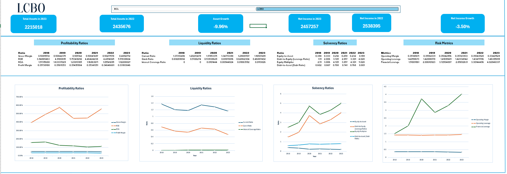
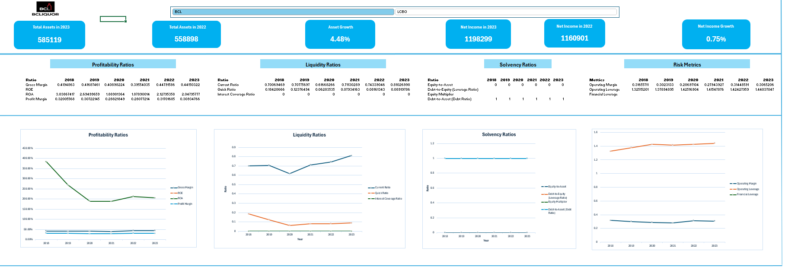
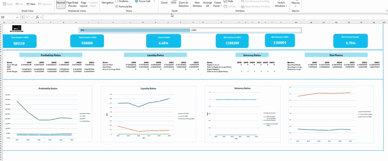

# Project Overview
This project compares the financial performance of BCLDB and LCBO using publicly available financial reports. It involves data extraction, cleaning, analysis, and dashboard visualization to highlight key insights.
## 1. Companies Overview
### 1.1 BCLDB Overview
The British Columbia Liquor Distribution Branch (BCLDB) is a government-owned entity responsible for the wholesale distribution, the retail sale of alcoholic beverages, and regulating other private retailers in British Columbia. It operates under the provincial Ministry of Finance. Its management structure is strictly controlled by the provincial government. 
### 1.2 LCBO Overview
The Liquor Control Board of Ontario (LCBO) is a Crown corporation owned by the Ontario government. Unlike the BCLDB, the LCBO operates with greater autonomy and functions as a self-sustaining enterprise with its own board of directors.
## 2. Data Collection
### 2.1 Data Sources
- For BCLDB, the financial data was sourced from BCLDB annual reports for fiscal years 2018-2019 through 2023-2024 available at https://www.bcldb.com/publications/annual-report, downloaded as PDF. 
- For LCBO, the financial data was sourced from LCBO annual reports for fiscal years 2018-2019 through 2023-2024 available at https://www.lcbo.com/content/lcbo/en/corporate-pages/about/annual-report-business-plan-intro.html?srsltid=AfmBOor2Lyn8VQaMGMpQUVGcntO8LjIAy95krFrDekzjz0TD0IAhkE5k
### 2.2 Data Extraction
I used the (```Tabula```) in Python to extract the financial statements from the annual reports and then save each statement in CSV format. Using the code below:
  
  ```
  from tabula import read_pdf
  pdf_path = "filename.pdf"
  # Extract tables from all pages
  tables = read_pdf(pdf_path, pages="all", multiple_tables=True)
  # Save each extracted table as CSV files
  for i, table in enumerate(tables):
      csv_filename = f"BCLDB_Table_{i+1}.csv"
      table.to_csv(csv_filename, index=False)
      print(f"Table {i+1} saved as {csv_filename}")
  
  ```
 ### 2.3 Data Cleaning
The extracted data were merged in one CSV file, cleaned and validated in Excel
 
## 3. Exploratory Analysis
- This was done using Pivot Table in Excel.
- The financial ratios were calculated via automation using ```calculated items``` under ```Fields, Items & Sets```
- After calculating all the ratios, ```slicer``` was inserted for company comparison and ```timeline``` for yearly trends
- On separate worksheets, the YoY performance/trends of the financial metrics were visualized using the ```line chart``` of the ```pivot chart```, and chart formatting/design was done appropriately using ```chart design```
- On another worksheet, I created a professional interactive dashboard using the chats and calculated metrics
- missing data/error ```#DIV/0 Error``` was controlled for using the ```IFFERROR``` function in excel

 <p align="center"><sub>Figure 1: LCBO financial performance dashboard</sub></p>

 <p align="center"><sub>Figure 2: BCLDB financial performance dashboard</sub></p>


<p align="center"><sub>Gif 1:  The interactive financial performance dashboard for BCLDB & LCBO</sub></p>

## 4. Key Insights

### 4.1 Profitability and Asset Utilization
BCLDB's declining Return on Assets (ROA) from 383.87% in 2018 to +260% in 2019 and 204.80% in 2023 may suggest the inability of BCLDB to generate returns from its investments in new assets. This could be due to the addition of cannabis distribution in 2018, which required new infrastructure and systems, potentially increasing assets without proportional revenue growth initially.

### 4.2 Equity and Return on Equity (ROE)
- BCLDB's Zero Equity: As a direct government entity, BCLDB doesn't retain earnings or equity. All profits are transferred to the provincial government, leaving no equity on the balance sheet. This structure makes ROE calculation impossible due to the absence of equity.
- LCBO's Increasing ROE: LCBO operates as a Crown corporation with more financial autonomy. It maintains a small equity base, allowing for ROE calculation. The high ROE indicates efficient use of the limited equity retained.
### 4.3 Liquidity and Solvency
- Different Operational Models: LCBO's semi-autonomous status allows for better working capital management.
- Cash Management Practices: LCBO may retain more cash for operations, while BCLDB transfers more frequently to the provincial government.
### 4.4 Debt Utilization
- BCLDB,
 - Debt-to-Asset Ratio is consistently 1.0
 - Debt-to-Equity Ratio: Zero (due to absence of equity)
   These indicate that all of BCLDB's assets are financed by liabilities. In practical terms, the provincial government of British Columbia owns all assets, while BCLDB operates them.
- LCBO:
Debt-to-Asset Ratio: Increased from 0.6 in 2018 to 0.8 in 2023
Debt-to-Equity Ratio: Rose from 1.5 in 2018 to 4.0 in 2023
This trend indicates LCBO's increasing use of debt financing for growth and operations.

### 4. 5 These differences stem from
- Risk Management Approaches: BCLDB's structure minimizes financial risk but limits flexibility, while LCBO's approach allows for more strategic financial management.
- Growth Strategies: LCBO's debt utilization may enable more growth and investments.
- Operational Autonomy: LCBO's structure provides more independence in financial decision-making.

## 5. Conclusion
The financial performance differences between BCLDB and LCBO are primarily driven by their distinct governance structures. BCLDB operates as a direct government entity with zero equity, limiting its financial flexibility but minimizing financial risk. In contrast, LCBO functions as a more autonomous Crown corporation, allowing for strategic financial management, including debt utilization and retained earnings.


